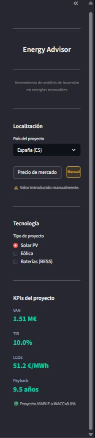
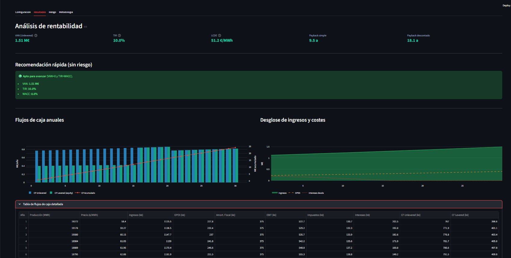
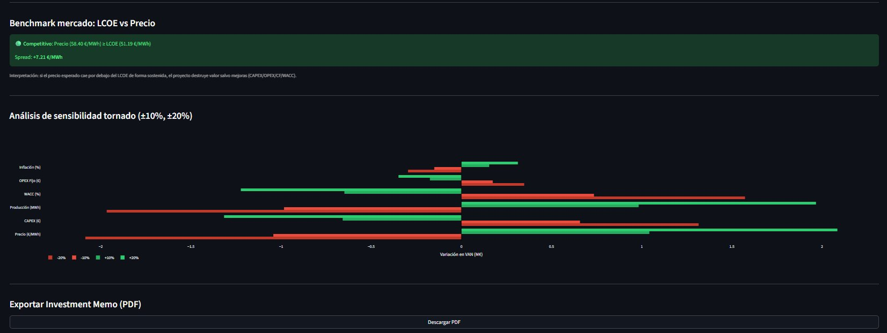
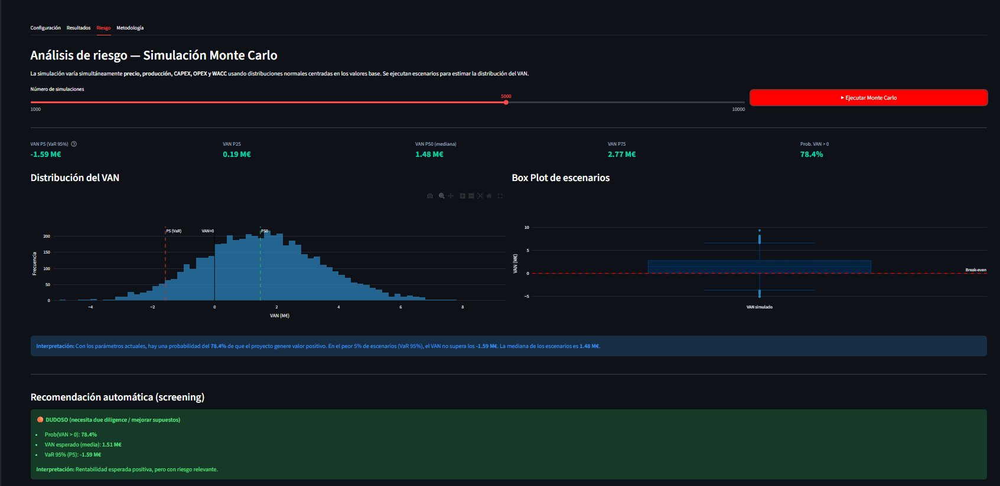
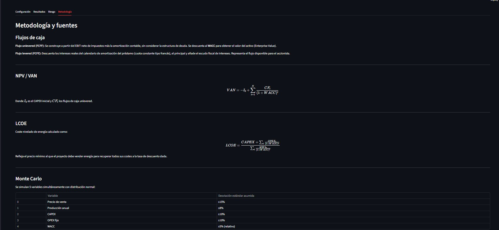

# Energy Advisor

Language: English | [Español](README_ES.md)

> Interactive financial modelling tool to evaluate renewable energy investments using discounted cash flows.

Built to explore how project finance analysis can be made interactive and accessible — without Excel.


---
---

## Table of Contents

- [Online Demo](#online-demo)
- [What it does](#what-it-does)
- [Screenshots](#screenshots)
- [Tech stack](#tech-stack)
- [Run locally](#run-locally)
- [Project structure](#project-structure)
- [Live market prices](#live-market-prices)
- [Methodology notes](#methodology-notes)
- [Data sources](#data-sources)
- [Disclaimer](#disclaimer)
- [License](#license)

---

---

## Online Demo

The application is deployed and can be tested directly here:

👉 https://investment-decision-support-tool.streamlit.app/

---

## What it does

- Calculates **NPV**, **IRR**, **LCOE** and **Payback** (simple and discounted)
- Models unlevered and levered cash flows with a real debt amortisation schedule (French annuity)
- Runs **Monte Carlo simulation** (up to 10,000 scenarios) — NPV distribution, 95% VaR, probability of positive NPV
- **Tornado sensitivity analysis** across six key drivers (±10% / ±20%)
- Fetches **live electricity prices** from OMIE (Spain/Portugal, no token) and ENTSO-E (Germany/France, free token)
- Generates a **PDF Investment Memo** — screening report ready to share
- **Screening verdict** (Pass / Review / Fail) combining deterministic and risk-based checks

---

## Screenshots

**Sidebar — KPIs & project configuration**


**Results — NPV, IRR, LCOE and cash flow charts**


**Sensitivity analysis — Tornado chart & LCOE benchmark**


**Risk — Monte Carlo simulation & screening verdict**


**Methodology — formulas and data sources**


---

## Tech stack

| Layer | Library |
|---|---|
| UI | Streamlit 1.32 |
| Data validation | Pydantic v2 |
| Numerical computing | NumPy, numpy-financial |
| Data manipulation | Pandas |
| Visualisation | Plotly |
| PDF generation | ReportLab |
| HTTP client | requests |

---

## Run locally

```bash
git clone https://github.com/mcamposcarneros/Investment-Decision-Support-Tool.git
cd energy-advisor
pip install -r requirements.txt
streamlit run app.py
```

---

## Project structure

```
├── app.py           # Streamlit UI
├── finance.py       # Financial engine (DCF, Monte Carlo, sensitivity, market APIs)
├── requirements.txt
└── README.md
```

---

## Live market prices

| Market | Source | Authentication |
|---|---|---|
| Spain / Portugal | OMIE Day-Ahead public files | None required |
| Germany / France | ENTSO-E Transparency Platform (A44) | Free token |

If the live feed fails, the app falls back to 2024 annual average reference prices and shows a status indicator: **Live** / **Ref.** / **Manual**.

To connect ENTSO-E: register at [transparency.entsoe.eu](https://transparency.entsoe.eu/), generate a token under *My Account → Security Token*, and enter it in the app sidebar.

---

## Methodology notes

- LCOE follows IEA/IRENA pre-tax WACC methodology
- Debt modelled as a constant-payment (French annuity) schedule with declining interest charge
- Interest tax shield added back explicitly to the levered cash flow
- Monte Carlo samples price, production, CAPEX, OPEX and WACC simultaneously from independent normal distributions
- Screening verdict combines deterministic check (NPV > 0 and IRR > WACC) with risk-based check (P(NPV > 0) ≥ 70% and VaR 95% > −10% of CAPEX)

---

## Data sources

| Item | Source |
|---|---|
| Solar PV CAPEX | BNEF Solar PV Cost Report 2024 |
| Wind CAPEX | IRENA Renewable Power Generation Costs 2023 |
| Battery CAPEX | BloombergNEF BESS Outlook 2024 |
| O&M OPEX | IRENA O&M Cost Report 2023 |
| Capacity factors | ENTSO-E / REE Historical Generation 2023 |
| Fallback prices | OMIE / ENTSO-E Day-Ahead annual average 2024 |

### Default CAPEX benchmarks by country

| Country | Solar PV (€/kW) | Wind (€/kW) | Battery BESS (€/kWh) |
|---|---|---|---|
| Spain | 750 — BNEF 2024 | 1,250 — IRENA 2023 | 350 — BloombergNEF 2024 |
| Germany | 870 — Fraunhofer ISE 2024 | 1,480 — IRENA 2023 | 400 — BloombergNEF 2024 |
| France | 810 — ADEME 2024 | 1,380 — IRENA 2023 | 380 — BloombergNEF 2024 |

---

## Disclaimer


This is a personal project built for learning and experimentation purposes. It is not intended for real investment analysis or financial decision-making.

---

## License

MIT License — free for academic and personal use.

---

***María Campos Carneros, 2026***


